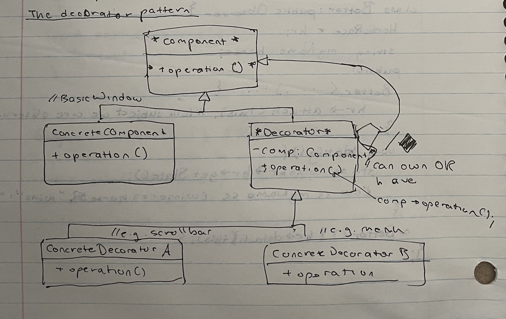

# CS 246, Lecture 18
###### 2022 June 30

## Observer Pattern
The observer pattern is a publish-subscribe model. There is one "publisher"/subject class that generates data, and one or more "subscribe"/observer classes that receive and react to data.

An example of this pattern in action would be in Excel spreadsheets, where the "publisher" would be the spreadsheet cells and the "observer"s would be the graphs and formula cells. When the spreadsheet cells change, the graphs and formula cells also change. 

The whole point of this pattern is to abstract change. There can be many different types of observer classes, and the subject should not need to know the details of all of them. 


Note: Just knowing you're watching a cell isn't enough; you need to know *exactly* what you're watching.

The abstract class Subject contains all the code common to subjects. The abstracst class Observer contains the interface common to all observers. 

The sequence of method calls for observers goes as follow:
1. `Subject`'s state is changed
2. `Subject::notifyObservers` is called (either by the concrete subject when the change happens, or by the client when they change the subject)
3. `NotifyObservers` calls `notify` on each `Observer`
4. Each `ConcreteObject::notify` gets the data from their subject (e.g. with `getState`) and react accordingly. 

Example: Horse races. The subject publishes the winner, the observers are individual bettors who react to winning or losing.
```
class Subject {
    vector<Observer *> observers;
    public: 
        Subject() {}
        void attach(Observer * ob) {observers.emplace_back(obj);}
        void detach(Observer * ob) {
            // assume each * only shows up once in our vector
            auto it = observers.begin();
            for(it; it != observers.end() && *it != obj; ++it);
            if(it == observers.end()) return;
            observers.erase(it);
        }
        void notifyObservers() {
            for(auto p: observers) p->notify();
        }
        virtual ~Subject() = 0; // doing just this will cause a linking error
};
Subject::~Subject() {} // resolves the linking error
```
If you want a class to be abstract, but don't naturally have a method to make pure virtual, make the destructor pure virtual (since it should always be virtual if you have inheritance). However, the destructor still needs an implementation or your code won't link.
```
class Observer {
    public: 
        virtual void notify() = 0;
        virtual ~Observer() {}
};
class HorseRace: public Subject {
    ifstream m; //source of data
    string lastwinner;
    public:
        HorseRace(const string & source): in{source} {}
        ~HorseRace() {}
        bool runRace() {bool b = in >> lastwinner; notifyObservers(); return b;}
        // We can also rely on client to notify observers and do this instead:
        // bool runRace() {return in >> lastwinner;}
        string getState() const {return lastwinner;}
};
class Bettor: public Observer {
    HorseRace *hr;
    string myName, horse;
    public:
        Bettor(...)... {
            hr->attach(this); // tells subject we are observing it
        }
        void notify() {
            string winner = hr->getState();
            cout << myName << (winner == horse ? "wins" : "loses");
        }
        ~Bettor() {hr->detach(this);;}
}
```

## Decorator Pattern
Suppose we want to enhance an object at runtime (e.g. add or change features). For example, a windowing system: we could start with a basic window, and have options to add a scrollbar and a menu. We would like to choose these options at runtime. Adding these at runtime means we could start with just a basic window and add a scrollbar when it becomes necessary. 



`class Component` defines the interface: operations your objects will provide. `ConcreteComponent` is your basic undecorated object, so it should offer base implementations of these. The decorator classes all inherit from `Decorator` which inherits from `Component`.

For example: pizzas


```
class Pizza {
    public: 
        virtual float price() const = 0;
        virtual string desc() const = 0;
        virtual ~Pizza() {}
};
class CrustAndSauce: public pizza {
    public:
        float price() const override {return 5.99;}
        string desc() const override {return "Pizza";}
};
class Decorator: public Pizza {
    Pizza * component; //owns-a relationship
    public:
        Decorator(Pizza *p): Component {p} {}
        virtual ~Decorator() {delete Component;} // since it owns component
        float price() const override {
            return component->price;
        }
        string desc() const override {
            return component->desc();
        }
};
class Topping: public Decorator {
    string theTopping;
    public:
        Topping(Pizza *p, string t): Decorator{p}, theTopping{t}{}
        float price() const override {
            return Decorator::price() + 1.25;
        }
        string desc() const override{
            return Decorator::desc() + " with " + theTopping;
        }
};
// StuffedCrust is similar
```
This is basically a linked list. Exercise: write code to remove decorations.