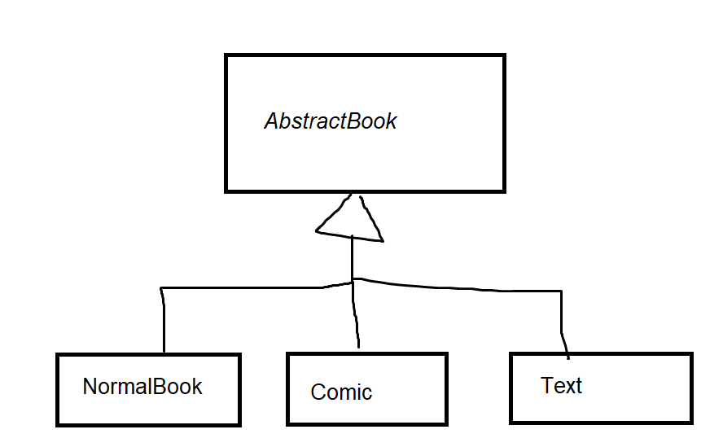

# CS 246, Lecture 19
###### 2022 July 05

```
class Book {
    public: 
    // defines copy/move constructors and assignment operators
};

class Text: public Book {
    string topic; 
    public:
    // don't define copy/move constructors
};

Text t{ "Algorithms", "CLRS", 35O, "CS"};
Text t2 = t;
```
There is no copy constructor in `Text`, so what happens? This copy initialization calls `Book`'s copy constructor and then goes field-by-field copy initializing (the built-in behaviour). The same is true for other compile-provided methods.

To write our own operations: 
```
Text::Text (const Text & other) : Book {other}, topic {other.topic} {} 
Text::Text (Text && other): Book{other}, topic{other.topic} {} // BAD: calls the copy constructor and not the move constructor on Book because other is not an r-value when called
// The thing that other refers to is an r-value. The thing that other is treated as is an l-value
// Instead:
Text::Text (Text && other): Book{std::move(other)}, topic{std::move(other.topic)}{} // correct; treated as an r-value here
```
Note even though the object `other` refers to is an r-value, `other` itself is a named parameter of a function (so it has a non-temporary lifetime). So `other` itself is an l-value. The `<utility>` header includes the function `std::move` which forces an l-value to be treated as an r-value so we can call move operations on it. 

```
Text &operator=(const Text &other) { // & is part of the data type!
    // Aside on naming conventions:
    // int x, y;
    // Bad: int& a = x, b = y; a is a reference to x, and b is just an integer copy of y. 
    // Good: 
    // int &a = x, &b = y; 
    // Also good: don't do multiple declarations in a line. 

    Book::operator=(other); // call book's operator= to copy private Book fields
    topic = other;
    return *this;
}

Text &other==(Text &&other) {
    Book::operator=(std::move(other));
    topic = std::move(other.topic);
    return *this;
}
```
These behaviours we've written for these two functions is the same as the compiler-provided ones. Specialize as needed for classes that require it.

Now consider
```
Text t1 {...}, t2 {...};
Book *pb1 = &t1, *pb2 = &t2;
*pb1 = *pb2; // what happens?
```
`Book::operator=` runs. This method is not virtual! The result is only the book fields assigned! **Partial assignment**.

Can we fix this by making it virtual?
```
class Book {
    public:
    virtual Book &operator=(const Book & o) {...} // as before
}
class Text::public Book {
    ...
    public: 
    Text &operator=(const Text &o) override {...} // doesn't compile
    // if we remove the override, it compiles... but doesn't do what it's supposed to do
    Text &operator=(const Book &o) override {
        // Compiles, but what do we say in here??
        Book::operator = o;
        topic = o.topic; // ?? Illegal, o is a Book
        return *this;
        // we can't do this, but even assuming we can, we still have problems        
    }
}
```
Note: `Text::operator=` is permitted to return by reference a subtype object and still be a valid override. *But* the param types *MUST* be the same or it is not a valid override. By the "is-a" principle, if a `Book` can be assigned by another `Book`, then the "is-a" principle says that a `Text` can be assigned to a `Book`. That's why the parameters must match.
```
Text t{...};
Book b{...};
Text *pt = &t;
*pt = b; // calls operator= with virtual dispatch, but uses a Book to assign to a Text. What happens to o.topic? Assigns memory outside of allocated
```
Also:
```
Comic c {...};
t = c; // uses a Comic object to assign to a text Object - BAD!
```
Before `operator=` has virtual and partial assignment through base class pointers, if it is virtual we get the problem of **mixed assignment**.

Assignment through base class pointers/references doesn't really make sense: we need to know the two objects we'rea ssigning as the same type, which defeats the purpose of working polymorphically.

Disallow assignment through base class pointers by making the assignment operator private, or more likely, protected (in the base class). It can stay public and non-virtual in derived classes. 

But now we have a new problem: we can't assign through the base class anymore! 
```
Text t{...};
Text a{...};
t = a; //allowed, good
Book *p = &t, z = &a; 
*p = *z; //illegal, but also good
// But it's now also illegal to do
Book b {...};
Book d {...};
b = d; // can't assigned Book objects - No good!
```
General recommendation: all base classes should be abstract.

```
class AbstractBook {
    string title, author; 
    int numpages;
    protected: 
        AbstractBook & operator(const AbstractBook &other) {...}
    public:
        AbstractBook(...);
        virtual ~AbstractBook() = 0;    
};
// implementation for ~AbstractBook 

class NormalBook: public AbstractBook {
    public: 
        NormalBook(...) ...
        ~NormalBook() {}
        NormalBook &operator=(const NormalBook & other) {
            AbstractBook::operator=(other);
            return *this;
        }
};
```
The other classes are similar. This design process prevents both partial and mixed assignments.

```
vector<int> v{inst, 3};
for(int i = 0; i < 10000; ++i) {
    cout << v[i] << endl;
}
```
`operator[]` ifor vectors is unchecked and assumes you are indexing a valid index. `vector::at` is a **checked** version of indexing. 
```
for(int i = 0; i < 1000; ++i) {
    cout << v.at(i) << endl;
}
```
`at` is checked - but what does it do when give an invalid index? 

In C, the solution is to either set a global error number or return a sentinel error variable (something that the function could never actually return). `vector::at` could validly return any value in its types' domain, and global error numbers/values lead to ugly code and as such often get ignored.

The C++ solution: raise an **exception**. An exception is some value raised (or thrown) by a function that ends execution of that function and passes that error along to the caller. `vector::at` can detect that the error has occured but doesn't know what to do about it. The caller can't detect the error but knows what they'd like to do in the chance of a failure. So error handling is an implicitly non-local problem.

`vector::at` specifically raises a `std::out_of_range` Object when a bad access is made. `std::out_of_range` is an exception class from the header `<exception>`. So what do we do about exceptions?

```
void f() {
    vector v{0, 1};
    v.at(10000);
}
void g() {
    f();
}
int main() {
    g();
}
```
`main` calls `g` which calls `f` which calls `vector::at`, which raises an exception. What happens? By default the program stops executing. More specifically, `vector::at` raises the exception, `f` receives it but does not deal with it, so it propagates the exception to `g`, which does the same thing so the exception reaches `main` and isn't handled there, so if an exception reaches `main` and `main` doesn't handle it, the program terminates. 
```
int main() {
    try {
        g();
    } catch (std::out_of_range e) {
        cout << "got error" << e.what() << endl;
    }
}
```
If exception-raising code is wrapped in a try/catch block, it can handle the exception if it has a matching handler. What if `g` wants to catch the exception, handle some behaviour, and raise another exception?
```
class someError {};
void g() {
    try {
        f();
    } catch (std::out-of-range e) {
        throw someError{};
    }
}
int main() {
    try {
        g();
    } catch (someError e) {
        cout << "got error" << endl;
    }
}
```
What if `g` wanted to raise the same error?
```
void g() {
    try {
        f();
    } catch (std::out-of-range e) {
        throw; 
    }
}
```
Why just `throw` and not `throw e`? Next class.