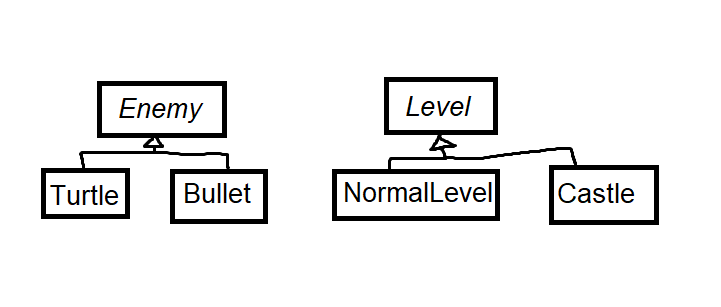

# CS 246, Lecture 20
###### 2022 July 07

The beginning of this note session is bad because my laptop didn't work properly at the beginning of class.

The handler can do part of the recovery job.

It can also return the same exception: 
```
try {...}
catch (someErrorType s) {
	... 
	throw;
}
```

Why `throw` vs `throw s`?  The exception s might actually belong to a subclass
of someErrorType, rather than someErrorType itself. `throw s` would throw
the local copy s, which is a sliced version of the original exception. On the
other hand, `throw;` rethrows the actual exception that was the catalyst, and its
type is maintained.

A handler can be used as a catch-all:
```
try {.....}
catch (...) { // literally three dots
....... // figuratively representing code
}
```

You can throw anything you like, not just objects. But generally exceptions should 
only be used for exceptional cases (errors that arise). You typically want a 
meaningful error class. So you define your own or use an appropriate existing one.
(Note: exceptions have innate overhead)

```
class BadInput{};
try {
	int n; 
	if(!(cin>>n)) throw BadInput{};
} catch (BadInput &t) {
	cerr << "Input not well formed" << endl;
}
```
Note here the exception was caught by reference, this prevents the exception 
from being sliced (if it actually was sliced). Catching exceptions by reference
is usually the right thing to do, in C++ we usually "throw by value, catch by 
ref". 

When `new` fails it throws `std::bad_alloc`. Warning! NEVER let a destructor 
throw, by default the program will terminate immediately because the compiler implicitly
marks destructors as functions that should never throw. It is possible to create a
throwing destructor by overruling this implicit decision. But you still shouldn't.

If a destructor throws as a result of it executing due to stack unwinding caused
by another exception, you now have two unhandled exceptions and the program will
abort immediately, no other objects further down the call chain get cleaned up.

## Factory method pattern
**Problem**: write a video game with two types of enemies, turtles and bullets. 
The system randomly sents turtles and bullets, but bullets become more frequent in later
levels.



Since we never know exactly what enemy comes next, we don't want to call 
constructors directly, moreover we don't want to hardcode the decision policy, as we want it 
to be customizeable. 

So instead we put a factory method in Level that creates enemies.

```
class Level {
	public:
	virtual Enemy * createEnemy() = 0;
	...
};

class NormalLevel: public Level {
	public: 
	Enemy * createEnemy() override {
		// create mostly turtles
	}
};

class CastleLevel: public Level {
	public:
	Enemy * createEnemy() override {
		// create mostly bullets
	}
};
```
Good for specialized behaviour.

## Template Method Pattern
Used when we want subclasses to override some aspects of superclass behaviour,
but other aspects must stay the same, e.g. there are red and green turtles. 
Subclasses shouldn't change the way the turtles' feet or head are drawn, but
can change the drawing of the shell. 

```
class Turtle {
	public: 
	void draw() {
		drawHead();
		drawShell();
		drawFeet();
	}
	private:
	void drawHead() {...}
	void drawFeet() {...}
	virtual void drawShell() = 0;
	// yes, virtual methods can be private.
};

class RedTurtle: public Turtle {
	void drawShell() override { 
		// draw red shell
	}
};

class GreenTurtle: public Turtle {
	void drawShell() override {
		// draw green shell
	}
};
```

Solution: make a public non-virtual method to wrap your virtual method.

## Extension: Non-Virtual Interface (NVI) idiom. 

A public virtual method is really two things.
- An interface to the client (because it's public)
	- Indicates a promise of provided behaviour, class invariant, and 
	  pre/post conditions
- An interface to the subclasses (because it's virtual)
	- A "hook" for subclasses to insert specialized behaviour. 
The NVI idiom says that a function should never be both of these two things. 
But it's hard to separate these two ideas if they're wrapped up in the same
function declaration. 

What if you want to later separate the customizable behaviour into two methods,
with some non-customizable steps in-between, without changing the public 
interface? There's no way to do this while keeping the function public and 
virtual.

Your base class is making promises it can't keep. Your public interface may
promise specific behaviour, but derived classes can do whatever they want in
overriding it. 

The NVI Idiom says 
- All public methods should be non-virtual
- All virtual methods should be private or at least protected 
- Except, of course, for the destructor

e.g. 
```
class DigitalMedia {
	public:
	virtual void play() = 0;
	virtual ~DigitalMedia();
};
```
Translated to NVI, this becomes
```
class DigitalMedia {
	public:
	void play() {
		checkDRM();
		doPlay();
		showCoverArt();
	}
	virtual ~DigitalMedia();
	private:
	virtual void doPlay() = 0;
	virtual void showCoverArt() = 0;
	void checkDRM() {...} // non virtual
};
```
Now if we need to exert control over `play` we can do it. For example,
- Add a DRM check before calling `doPlay`
- We can add more "Hooks" by additional virtual functions (e.g. showCoverArt())

All of this without changing the public interface.

It is much easier to take this kind of control over our virtual methods from
the beginning rather than to try and take it back later after much code has 
been written. 

The NVI idiom is effectively an extension of the template method
pattern, saying *all* virtual methods should be in a non-virtual wrapper, and
there is essentially no downside, as if the wrapper only calls that virtual 
function, any good compiler will optimize the extra function call.

## STL Maps: for creating dictionaries

Example: mapping strings to ints
```
#include <map> // <unordered_map> is faster than <map> if you don't care about order of iterating
using namespace std;
...
map<string, int> m;
m["adc"] = 1; // adding key to map: indexing value by that key
m["def"] = 4;
cout << m["abc"] << endl; //1
cout << m["ghi"] << endl; // key will be added if not found, default initialized
// This calls int {}, so the val is default-initialized to zero.
m.erase("abc");
if(m.count("def")) ... // 0 if not found, 1 if found
for (auto &p: n) { // sorted key order if map
	cout << p.first << ' ' << p.second << endl; // fields, not methods
	//p's type here is std::pair<string, int> &
	// Pairs are defined in <utility>.
}
```
A small detour on default initialization for integral types:
```
int n; // uninitialized 
int n{}; // default initialized, value is zero.
```