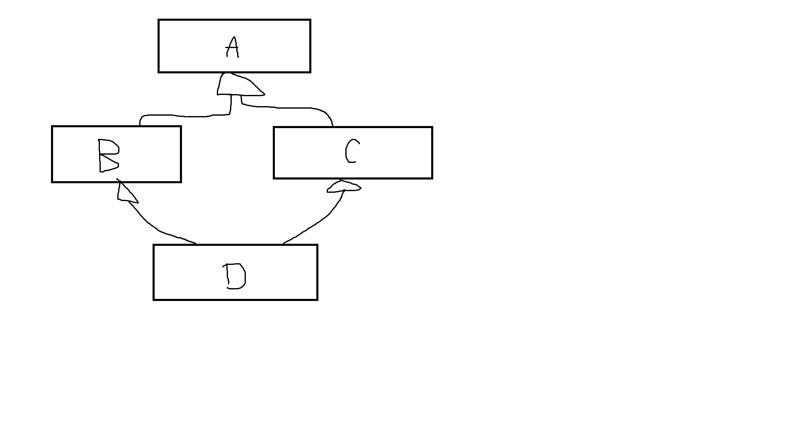

# CS 246, Lecture 24
###### 2022 July 21

## Casting
In C:
```
Node n;
int *p = (int *)&n;
// a cast, forces c++ to treat a Node * as an int *
```
Casts should be avoided. If you must cast, you should use c++ style casts.

C++ casts come in 4 varieties:
- `static_cast` is for "sensible casts", with well-defined behaviour. E.g.
    - Double to int: 
        ```
        double d{...};
        void f(int x);
        void f(double d);
        f(static_cast<int>(d));
        ```
    - Superclass pointer to a subclass pointer. BUT, we must know it actually points at that object.
        ```
        Book *b = new Text{...};
        Text *t = static_cast<Text *>(b);
        ```
        You are taking responsibility that `b` actually points at a text, essentially you are telling the compiler to just trust me bro.
- `reinterpret_cast` is for unsafe, implementation-dependent, "weird conversions", almost all uses of `reinterpret_cast` result in undefined behaviour.
    ```
    Student s;
    Turtle *t = reinterpret_cast<Turtle *> (&s);
    // forces a student to be treated like a turtle
    t->beStruckBy(Stick{});
    ```
- `const_cast` is for converting between const and non-const. It is the only c++ style cast that can "cast away constness". 
    ```
    void g(int *p); // you KNOW g doesn't actually modify *p
    void f(const int *p) {
        ...
        g(const_cast<int *>(p));
        ...
    }
    ```
    On the other hand, if `g` does change *p, this is very bad!!
- `dynamic_cast`: is it safe to convert a Book * to a Text *?
    ```
    Book * pb = ...;
    Text * t = dynamic_cast<Text *>(pb);
    // is this a safe cast? Only if pb actually points at a text.
    ```
    `dynamic_cast<T *>(p)` returns `p` as a `T*` if `p` actually points at a `T`. Otherwise, it returns a `nullptr`. It works by looking at the vptr of that object, so it only works on hierarchies with at least one virtual function.
    ```
    void whatIsIt(Book *pb) {
        if(dynamic_cast<Text *>(pb)) {
            cout << "Text" << endl;
        } else if(dynamic_cast<Comic *>(pb)) {
            cout << "Comic" << endl;
        } ...
    }
    ```
But, all of these operations are on raw pointers. Can we do equivalent operations on smart pointers? Yes, and they are declared in `<memory>`.
- `static_pointer_cast`
- `const_pointer_cast`
- `dynamic_pointer_cast`
Dynamic casting also works on refs:
```
Text t{...}; 
Book &b = t;
Text &tw = dynamic_cast<Text &>(b);
```
If `t` actually refers to a text, the `dynamic_cast` returns a Text & to it. If not, there is no such thing as a null reference, so it raises the exception `bad_cast`.

With `dynamic_cast`, we can (if we want) implement a polymorphic assignment operator.
```
Text &operator=(const Book &t) {
    // virtual in its base class
    const Text &t = dynamic_cast<Text &>(b);
    if(this == &t) return *this;
    Book::operator=(t);
    topic = t.topic;
    return *this;
}
```
But, this hasn't really solved the problem, just passed the burden onto the client who must now handle the exceptions raised by mixed assignment through base class pointers/references. It's still true that polymorphic assignment doesn't really make sense, so the preferred solution is still as it was before. All base classes should be abstract, and make the assignment operator protected in the base class.

## Multiple inheritance
```
struct A {
    int a;
};
struct B: public A {
    int b;
};
struct C: public A {
    int c;
};
struct D: public B, public C {
    int d;
};

D d;
d.a = 15; // error: D has two a's, one from its B component and one from its C component
d.B::a = 15;
d.C::a = 15;
```

This is called the deadly diamond problem, or the diamond of death, or the deadly diamond of death. 

What we really want is a singular A field: **virtual inheritance**.

## Template functions
```
template <typename T>
T min(T x, T y) {
    return x < y ? x : y;
}
int f() {
    int x = 1, y=2;
    int z = min(x,y);
    //T = int
}
```
I didn't say `min<int>(x,y)` - I CAN say that, but if the compiler can deduce the template types (typically if your template types are your params, it can deduce based on any type), then we don't need to explicitly specify.

Template functions operating on iterators are very effective C++, e.g.
```
template <typename Iter, typename Func>
void for_each(Iter start, Iter end, Func f) {
    while(start != end) {
        ...
    }
}
```
What is callable other than a function? 

Anything that overloads operator(), the function call operator.
```
class Plus {
    int toAdd;
    public:
        Plus(test toAdd): toAdd(toAdd) {}
        void operator() (int &n) {n= n + toAdd;}
}

Plus add5{5};
for_each(p, p+5, add5); // adds 5 to each element in p.
```
`for_each` and functions like it already exist. They're in the `<algorithm>` header and most of them operator on Iterators. I suggest you familiarize yourself with this library and what it can do for you.

`for_each(p, p+5, [](int &x) {n= n+5})` - lambda functions
```
int x = 5;
[x](int &n){n = n + x};
```